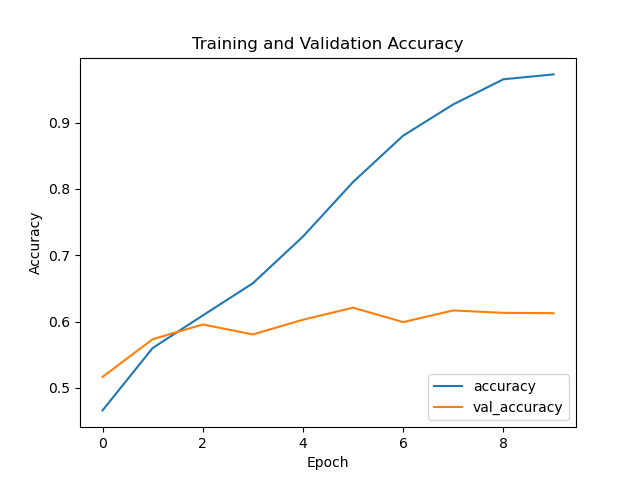
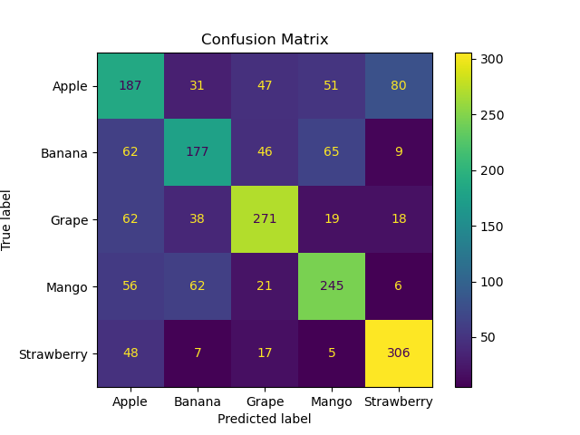
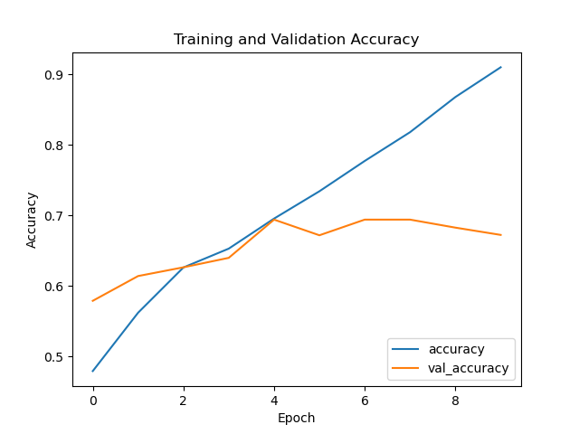
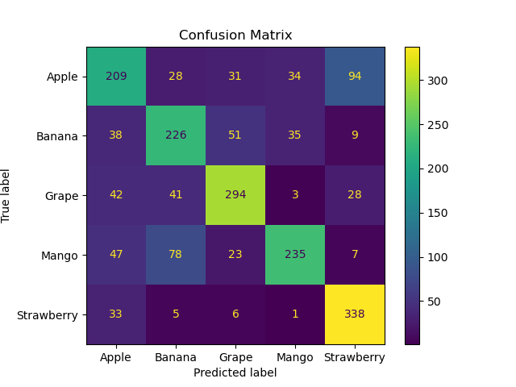
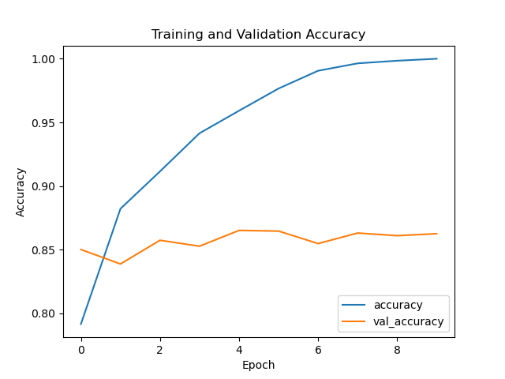
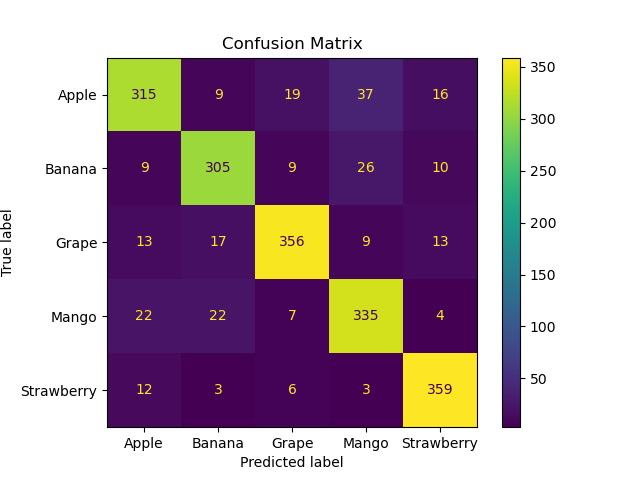
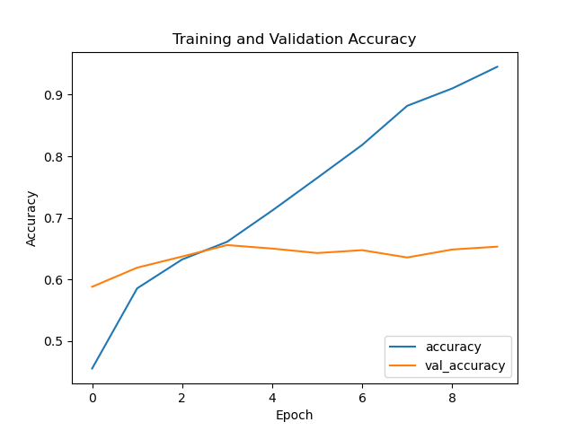
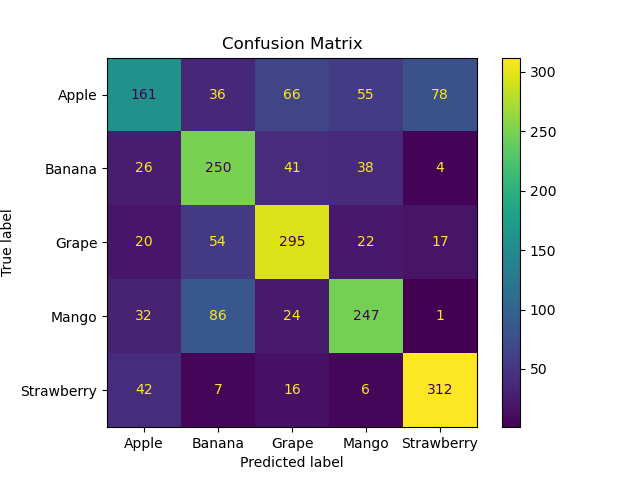
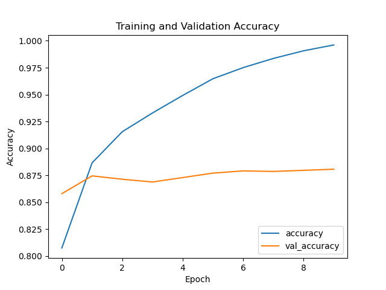

# Capturing the Future of Supermarket Fruit Sales

In a world where technology advances rapidly, supermarkets constantly seek ways to enhance customer experience and optimize their operations. Our fruit image detection project using a machine learning model aligns perfectly with these trends, offering innovative and effective solutions to current challenges.

Imagine a supermarket where customers no longer struggle to correctly identify fruits at self-service scales. Instead, they can use smart scales equipped with our model, which automatically recognizes each fruit, providing precise identification without errors. This small change not only reduces wait times but also minimizes the frustrations associated with incorrect identification.

For supermarkets, this system represents a significant improvement in current computerized processes. By eliminating classification errors, economic losses associated with incorrect product identification are reduced. This not only optimizes cash flow but also increases customer satisfaction as they receive faster and more efficient service.

Although we have not yet implemented all security measures, we are aware of the importance of addressing data privacy and security issues in the future. We are committed to developing and applying strict security and compliance measures to ensure that consumer data is handled ethically and securely. Transparency and trust will be fundamental pillars of our proposal.

The benefits of this technology are vast. Consumers enjoy a quick and hassle-free shopping experience, with access to always fresh products. Supermarkets, on the other hand, optimize their operations, reduce costs, and obtain valuable data on customer preferences and behaviors. This data allows for better inventory planning and more effective marketing strategies, benefiting both businesses and consumers.

In summary, the implementation of our fruit image detection model not only modernizes the shopping experience but also promises a future where efficiency and customer satisfaction are at the heart of supermarket operations. This is a step towards the evolution of retail, where technology and innovation come together to create an ideal shopping environment for all.

## Next Steps

As we move forward with this pilot project, we have outlined several next steps to ensure its success and continuous improvement:

### Pilot Implementation
- Launch the pilot in selected supermarkets to test the model in real-world conditions.
- Gather feedback from both customers and staff to identify areas for improvement.

### Data Collection and Analysis
- Collect and analyze data on the model’s performance, focusing on accuracy and user experience.
- Use this data to refine the model and address any identified issues.

### Security and Privacy Measures
- Develop and implement comprehensive security protocols to protect consumer data.
- Ensure compliance with all relevant data protection regulations.

### Training and Support
- Provide training for supermarket staff on how to use and maintain the new system.
- Establish a support system for ongoing technical assistance.

### Scalability and Expansion
- Assess the scalability of the model for implementation in additional supermarkets.
- Plan for a phased rollout based on the success of the initial pilot.

By following these steps, we aim to enhance the functionality and reliability of our fruit image detection model, ensuring it meets the needs of both supermarkets and their customers.

# Model Analysis Summary

## Model 1

### Training and Validation Accuracy:
The graph depicts the training and validation accuracy of Model 1 over 10 epochs. The training accuracy shows a steady increase, indicating that the model is progressively learning and fitting the training data better. However, the validation accuracy exhibits a slight initial rise followed by fluctuations, and it remains substantially lower than the training accuracy. This pattern suggests that while the model is becoming more accurate on the training data, it is not generalizing well to the validation data, indicating possible overfitting.

### Confusion Matrix:
The confusion matrix provides detailed insights into the performance of the classification model for predicting five categories: Apple, Banana, Grape, Mango, and Strawberry.

Here’s a breakdown:
- **Apple:** Correctly classified: 187, Most common misclassifications: Mango (51), Strawberry (80)
- **Banana:** Correctly classified: 177, Most common misclassifications: Mango (65), Apple (62)
- **Grape:** Correctly classified: 271, Most common misclassifications: Apple (62), Banana (38)
- **Mango:** Correctly classified: 245, Most common misclassifications: Banana (62), Apple (56)
- **Strawberry:** Correctly classified: 306, Most common misclassifications: Apple (48), Banana (17)

The confusion matrix reveals that while the model performs well in classifying certain categories like Grape and Strawberry, it struggles more with others, notably Apple and Mango, which are frequently misclassified as other fruits. This indicates areas where the model could be improved.

## Model 2

### Training and Validation Accuracy:
In the training and validation accuracy graph for Model 2, the training accuracy steadily increases, reaching nearly 0.9, while the validation accuracy shows an upward trend initially but plateaus and slightly decreases towards the end, stabilizing around 0.7. This suggests that the model is learning well on the training data but is starting to overfit as the validation accuracy does not increase correspondingly after a certain point.

### Confusion Matrix:
The confusion matrix for Model 2 shows better performance compared to Model 1. The counts for true positives (diagonal elements) are higher across most categories, especially for "Grape" and "Strawberry," indicating that Model 2 has improved its classification accuracy for these categories. There are fewer misclassifications overall, as seen in the reduced off-diagonal counts compared to Model 1.

## Model 3

### Training and Validation Accuracy:
- **Training Accuracy:** The training accuracy for Model 3 starts around 0.80 and quickly rises to 1.00, indicating the model learns the training data very well over epochs.
- **Validation Accuracy:** The validation accuracy starts at 0.85 and slightly increases but then plateaus around 0.86. This indicates that while the model learns the training data very well, it does not generalize as effectively to the validation data, suggesting potential overfitting.

### Confusion Matrix:
Model 3 shows a balanced and accurate confusion matrix with higher correct classifications and fewer misclassifications compared to Models 1 and 2.

## Model 4

### Training and Validation Accuracy:
- **Training Accuracy:** Improves consistently, reaching close to 0.9 by the 9th epoch.
- **Validation Accuracy:** Starts around 0.6, fluctuates slightly, but generally trends upwards, peaking at around 0.7. There is a noticeable gap between the training and validation accuracy, indicating potential overfitting.

### Confusion Matrix:
Model 4 shows high training accuracy but noticeable overfitting and confusion in certain categories.

## Model 5

### Training and Validation Accuracy:
- **Training Accuracy:** Reaches close to 1.0.
- **Validation Accuracy:** Starts high, fluctuates slightly, and stabilizes around 0.875.

### Confusion Matrix:
Model 5 demonstrates the best overall performance with high accuracy across all categories:
- **Apple:** 318 correct
- **Banana:** 315 correct
- **Grape:** 368 correct
- **Mango:** 343 correct
- **Strawberry:** 361 correct

There are minimal misclassifications, indicating a robust model.

## Overall Comparison:

- **Accuracy:** Model 5 shows the best overall accuracy in both training and validation phases. It also has the highest number of correct predictions across all categories.
- **Stability:** Models 3 and 5 show the least fluctuation in validation accuracy, indicating more stable performance.
- **Misclassifications:** Model 3 and Model 5 have the fewest misclassifications, making them the most reliable for predictions.

### Recommendation:
Based on the comparison, Model 5 is the most robust and accurate for predicting the given categories, followed closely by Model 3.

## Dataset Information
The dataset used for training the neural network models can be found on Kaggle: [Fruits Classification Dataset](https://www.kaggle.com/datasets/utkarshsaxenadn/fruits-classification).

